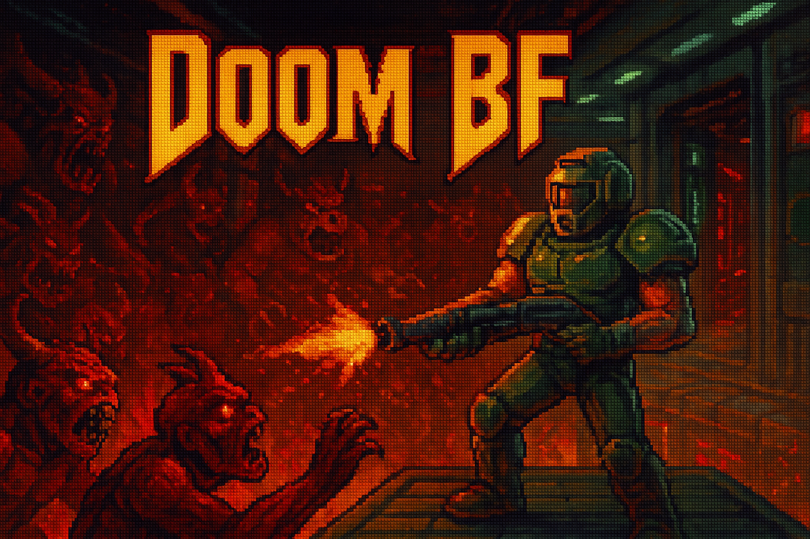

# DoomBF

На связи
[Мастерская системного программирования ИТМО](https://t.me/itmosysint)

> **Идея:** собрать *Doom* и запустить его поверх Brainfuck.  
> Мы используем оригинальный исходный код Doom, компилируем его в Brainfuck, а затем исполняем BF‑код в собственной среде.



**Репозиторий:** https://github.com/sit-itmo/DoomBF  

Проект является совместным творчеством группы энтузиастов в рамках студенческого сообщества ФБИТ ИТМО.

## Статус проекта
Прототипирование активно идёт: уже есть рабочие заготовки, среда для Windows и первые результаты.

## Что уже сделано
1. **Оснастка для Windows:** система сборки, скрипты и утилиты — собирается и тестируется.
2. Взят оригинальный код Doom и добавлена С‑обвязка **CrtDoom**, которая сводит API к двум функциям (см. `doom_env.h`).
3. Реализация внешней среды для CrtDoom под Windows — `win_doom.c` — **работает**.
4. Заготовки реализаций среды для Linux (`lnx_doom.c`) и macOS (`mac_doom.m`) — пока **не подключены** к скриптам сборки.
5. Добавлен оригинальный код **tcc**; сейчас он используется для сборки Doom‑кода (без модификаций).
6. Написаны **два** интерпретатора Brainfuck на C; ведётся серьёзная работа по оптимизациям.
7. Подготовлен ряд примеров на Brainfuck — в папке `b` (спасибо за развитие примеров и добавление варианта `JMP`).


## Актуальные задачи (Roadmap)
- [ ] Исправить структуру проекта: добавить каталоги `frontend/`, `crt/`, `tests/`.
- [ ] Починить скрипты/сборку для поддержки **Linux**‑среды.
- [ ] Починить скрипты/сборку для поддержки **macOS**‑среды.
- [ ] Добавить новую платформу в **tcc** для генерации `.b`‑кода.
- [ ] Расширить примеры и тесты BF в папке `b/`: математика, битовые операции, стек, `call`/`jmp`, и др.
- [ ] Добавить soft‑float реализацию на C (поддержка `float`) и интегрировать в **tcc** *(предварительно)*.
- [ ] Продолжить работу над BF‑интерпретаторами (оптимизации на усмотрение авторов).

## Быстрый старт (Windows)
Требуется:
- [CMake](https://cmake.org/)
- Компилятор из Visual Studio (или совместимый) — **только** для сборки `tcc`.

Сборка и запуск:
```bat
> build.cmd
> cd bin
> mini_doom.exe
```

## Планы по кроссплатформенности
Цель — поддержка Windows / Linux / macOS.  
Linux и macOS в стадии интеграции окружений (`lnx_doom.c`, `mac_doom.m`) и допила скриптов.

## Как поучаствовать
Присоединяйтесь к обсуждению и обратной связи: https://t.me/itmosysint

## Зачем это всё?
Эзотерические языки программирования — любопытны и трудны для человека; мы исследуем их потенциал на практике и хотим довести до играбельного результата хотя бы одну легендарную игру на одном из самых «жёстких» языков.

## Команда
- Участники сообщества: https://t.me/itmosysint  
- Координатор: Алексей Никольский — https://t.me/+2TZRYbxns6tlZjA6

Авторы (по алфавиту):
- Александр
- Александр Суров
- Алексей Никольский
- Виталий
- Иван

## Полезные ссылки
- https://brainfuck.org/brainfuck.html
- https://github.com/xoreaxeaxeax/movfuscator
- https://esolangs.org/wiki/Brainfuck_algorithms
- https://esolangs.org/wiki/BFFuck
- https://habr.com/ru/companies/badoo/articles/428878/ 
- https://spiiin.github.io/blog/621874082/ 
- https://github.com/srorso/SoftFloat

## Лицензия
Код публичный: использовать/скачивать/модифицировать — свободно. (При необходимости добавим отдельный `LICENSE`.)
