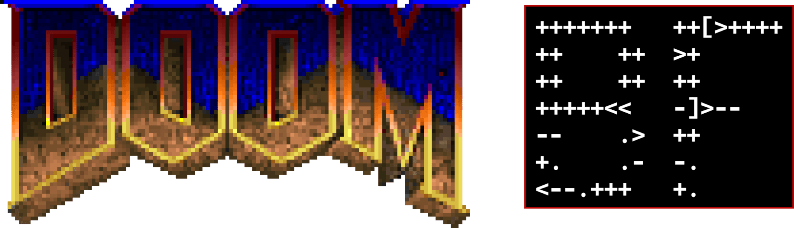

# DoomBF

На связи
[Мастерская системного программирования ИТМО](https://t.me/itmosysint)

> **Идея:** собрать *Doom* и запустить его поверх Brainfuck.
> Мы используем оригинальный исходный код Doom, компилируем его в Brainfuck, а затем исполняем BF‑код в собственной среде.



**Репозиторий:** https://github.com/sit-itmo/DoomBF

Проект является совместным творчеством группы энтузиастов в рамках студенческого сообщества ФБИТ ИТМО.

## Статус проекта
Doom успешно компилируется и запускается в brainfuck

## Что было сделано
1. Взят оригинальный код Doom и добавлена С‑обвязка **CrtDoom**, которая сводит API к двум функциям (см. `doom/crt/doom_env.h`).
2. Написаны **два** оптимизированных интерпретатора Brainfuck на C для запуска Doom (см. папку `bf`)
3. Подготовлен ряд примеров на Brainfuck — в папке `b` (спасибо за развитие примеров и добавление варианта `JMP`)
4. Написан скрипт для сборки Doom на архитектуре risc-v, работает только на linux (`make bfk_doom.elf`)
5. Создан компилятор из risc-v в brainfuck (см. папку `RISC-BF`)
6. Реализован фронтенд для отображения игры doom (см. папку `frontend`)


## Актуальные задачи (Roadmap)
- [ ] Добавить возможность компилировать Doom в brainfuck на windows и macOS
- [ ] Продолжить работу над BF‑интерпретаторами (оптимизации на усмотрение авторов).
- [ ] Сделать, чтобы make автоматически выбирал доступный risc-v

## Производительность
Doom запускается за несколько минут и выдает примерно один кадр в 40 секунд

## Быстрый старт
Требуется:
- Make
- riscv32-elf-gcc / riscv32-unknown-elf-gcc / riscv64-elf-gcc / riscv64-unknown-elf-gcc
- Python
- X11 SDK

### Для Linux

Предварительно надо установить X11 SDK. Для Debian/ubuntu:
```bash
$ sudo apt-get update
$ sudo apt-get install libx11-dev
```

Замените riscv32-none-elf-gcc в файле doom/Makefile на ваш установленный risc-v

Далее надо собрать компоненты:
```bash
$ IBF_JIT=1 make ibf
$ make bfk_doom.elf
$ make frnt
$ pip install -r RISC-BF/requirements.txt
```

Компиляция Doom из risc-v в сжатый brainfuck
```bash
$ python ./RISC-BF/risc_bf.py -c bfk_doom.elf doom.bpk
```

Запуск Doom на brainfuck с фронтендом
```bash
$ mkfifo pipe
$ ./ibf -ac doom.bpk < pipe | ./frnt > pipe
```

### Дополнительно

Запуск Doom в Linux (не на брейнфаке):
```bash
$ make lnx_doom
$ cd doom/data
$ ../lnx_doom
```

Запуск Doom через фронтенд (но не на брейнфаке):
```bash
$ make fake_bfk_doom
$ mkfifo pipe
$ ./fake_bfk_doom < pipe | ./frnt > pipe
```

Запуск тестов BF в Linux:
```bash
$ cd test
$ ./bench.sh
```

## Как поучаствовать
Присоединяйтесь к обсуждению и обратной связи: https://t.me/itmosysint

## Зачем это всё?
Эзотерические языки программирования — любопытны и трудны для человека; мы исследуем их потенциал на практике и хотим довести до играбельного результата хотя бы одну легендарную игру на одном из самых «жёстких» языков.

## Команда
- Участники сообщества: https://t.me/itmosysint
- Координатор: Алексей Никольский — https://t.me/+2TZRYbxns6tlZjA6

Авторы (по алфавиту):
- Александр Кравченко
- Александр Суров
- Алексей Никольский
- Виталий
- Иван Сакаев

## Полезные ссылки
- https://brainfuck.org/brainfuck.html
- https://github.com/xoreaxeaxeax/movfuscator
- https://esolangs.org/wiki/Brainfuck_algorithms
- https://esolangs.org/wiki/BFFuck
- https://habr.com/ru/companies/badoo/articles/428878/
- https://spiiin.github.io/blog/621874082/
- https://github.com/srorso/SoftFloat
- https://codeberg.org/highghlow/esotope-bfc
- https://github.com/tomhea/c2fj
- https://github.com/aidantambling/Fuse-Wad-Explorer
- https://people.math.sc.edu/Burkardt/c_src/paranoia/paranoia.html
- https://web.archive.org/web/20260312041643/http://www.jhauser.us/arithmetic/SoftFloat-3/doc/SoftFloat.html


